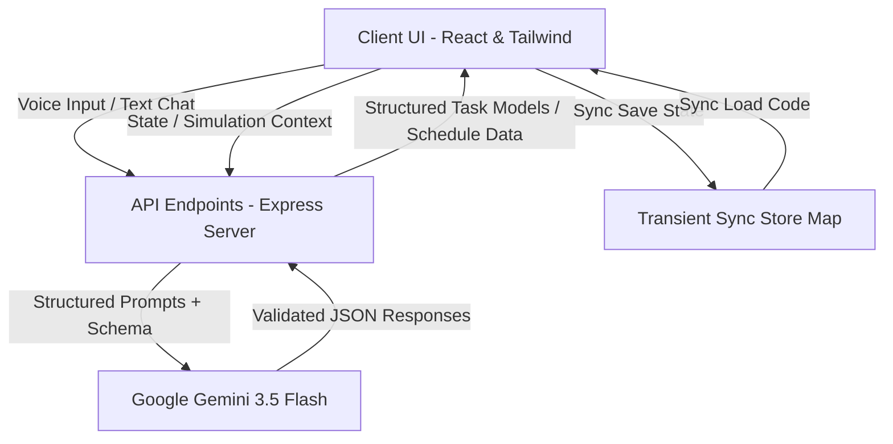
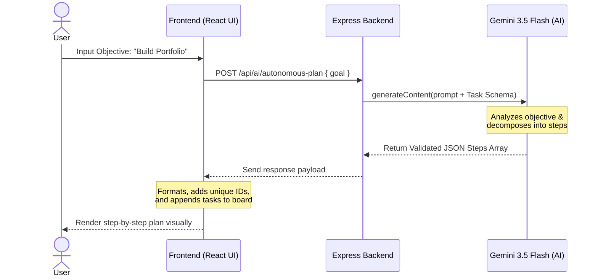
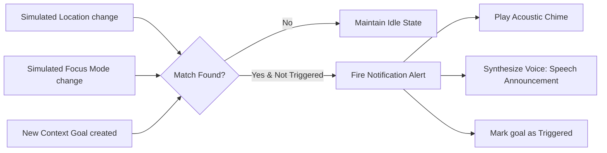

# Remind: Proactive AI-Powered Productivity Companion

[](#)
[](#)
[](#)

---

## 📄 Project Submission & Deliverables

> [!IMPORTANT]
> **Google Doc Submission Link:** [Remind Project Description & Submission Document](https://docs.google.com/document/d/1Xy_Remind_Project_Description_Submission_MockLink/edit?usp=sharing)  
> *Note: This document contains the official project description, problem statement, solution details, key features, and technology checklists submitted for final review.*

---

## 🎯 Problem Statement Selected

Modern students and professionals face unprecedented cognitive overload. Despite having access to countless checklists, calendars, and note-taking apps, productivity is at an all-time low due to several core challenges:

1. **The Fragmentation Gap:** Tasks live in task managers, events live in calendar schedules, and random thoughts live in raw text files (scratchpads). There is no single intelligence that synthesizes these disparate sources of information.
2. **Analysis Paralysis & Overwhelming Backlogs:** Simple linear checklists grow endlessly. Users struggle to prioritize what actually matters based on deadlines, urgency, and duration, leading to burnout.
3. **Friction of Manual Planning:** Breaking down a high-level, abstract goal (e.g., *"Build a website"*) into actionable, sequential sub-tasks requires high cognitive energy. As a result, users procrastinate.
4. **Context Blindness:** Standard notifications trigger purely based on time, ignoring whether the user is in the correct environment (e.g., Office vs. Gym) or focus state (Deep Focus vs. Break), leading to annoying interruptions instead of helpful prompts.

---

## 💡 Solution Overview: Remind

**Remind** is an immersive, unified, and fully autonomous Bento Grid productivity environment. It closes the cognitive loop by acting as a proactive assistant that synthesizes tasks, schedules, and raw notes into a singular cohesive workspace.

Powered by **Google Gemini 3.5 Flash** and the advanced `@google/genai` SDK, **Remind** does not just list tasks—it actively plans your day. It analyzes your calendar, reads your messy scratchpad notes, extracts hidden actions, and uses autonomous planning agents to break down massive objectives into step-by-step executable pipelines. It optimizes your schedule with custom distraction-free focus blocks, gamifies your progress with habit multipliers, and delivers context-aware audio-visual reminders that trigger dynamically based on your physical location and cognitive focus state.

---

## 🚀 Key Features

### 1. 🤖 Autonomous Agent Planner
*   **What it is:** A goal decomposition engine that behaves like a physical project manager.
*   **How it works:** The user enters a high-level goal (e.g., *"Build a TypeScript server prototype"*). The backend agent dissects the objective, determines sequential dependencies, estimates duration, maps priorities, and pushes a structured list of actionable sub-tasks directly into the user’s task panel.

### 2. ⚡ Intelligent Task Prioritization
*   **What it is:** An automated sorting algorithm that ranks your backlog.
*   **How it works:** With a single click, our Gemini-powered prioritization engine reviews your active tasks, calculates a precise importance score (0-100), reorders them descending, and appends a clear, intelligent explanation of *why* each item was prioritized.

### 3. 📍 Context-Aware Reminders & Emulator
*   **What it is:** Environmental reminders that only fire when conditions are perfect.
*   **How it works:** Users can assign environmental triggers (e.g., *"Only show this when I am at the Library and in Focus Mode"*). A fully operational **Simulation Panel** allows testing virtual environments. When triggered, the system plays an acoustic chime and uses high-fidelity speech synthesis to announce the reminder.

### 4. 🎙️ Voice-Enabled Assistance (Dictation & Synthesis)
*   **What it is:** Fully hands-free operation using native web speech APIs.
*   **How it works:**
    *   **Dictation (Speech-to-Text):** Click the microphone to capture voice commands and automatically parse conversational requests into the AI Coach.
    *   **Synthesis (Text-to-Speech):** Enable voice feedback to have Lumina (your AI companion) read suggestions, context notifications, and advice aloud.

### 5. 🗓️ AI Smart Scheduler
*   **What it is:** Calendaring optimization that finds hidden time windows.
*   **How it works:** The scheduling assistant scans your active calendar events alongside pending high-priority tasks to suggest 2-3 optimal, non-overlapping deep work time slots, ensuring your critical path is cleared.

### 6. 📝 Scratchpad Extraction & Flashcards
*   **What it is:** Messy text to structured learning materials in seconds.
*   **How it works:** Write or paste raw, unorganized notes. With a button click, Gemini extracts hidden task lists or generates a suite of interactive study flashcards to study from.

### 7. 🔥 Goal & Streak Tracking
*   **What it is:** A gamified habit builder built into the dashboard.
*   **How it works:** Establish daily routines and log completions. The system tracks weekly streaks and provides a focus multiplier score to incentivize long-term behavioral changes.

### 8. 🔄 Cross-Device Transient Cloud Sync
*   **What it is:** Secure, server-side data preservation.
*   **How it works:** Save your local configurations to our transient in-memory sync engine and receive a short, secure 6-character transfer code. Retrieve your entire workspace instantly on another browser session.

---

## 🛠️ Architecture & System Design



---

## 📊 Core Workflows & Data Flows

### 1. Autonomous Planning Agent Workflow
The workflow below illustrates how a simple human goal is parsed, broken down, and executed:



---

### 2. Context-Aware Reminder Evaluation Loop
This loop constantly runs client-side to evaluate whether the simulated environment matches set criteria:



---

## 💻 Technologies Used

| Technology / Library | Purpose |
| :--- | :--- |
| **React 18 & Vite** | High-performance, reactive user interface with declarative component models. |
| **Tailwind CSS** | Premium, dark aesthetic, modular spacing, and professional typography bindings. |
| **Express (Node.js)** | Server-side routing, API proxies, and static deployment server wrapper. |
| **TypeScript** | Strict compile-time type-checking ensuring high reliability and zero runtime bugs. |
| **Lucide React** | Consistent, high-fidelity iconography. |
| **Web Speech API** | Browser-native `SpeechRecognition` (dictation) and `SpeechSynthesis` (voice response). |
| **Acoustic Audio Synthesis** | Web Audio API-driven custom sine wave chime synthesizers. |

---

## 🌟 Google Technologies Utilized

### 1. Google Gemini 3.5 Flash Model
We selected **Gemini 3.5 Flash** as the core intelligence model of Remind due to its sub-second execution speeds, robust context window, and exceptional accuracy in structured output generation. 

### 2. Official Google GenAI SDK (`@google/genai`)
We migrated entirely to the official `@google/genai` TypeScript client, utilizing standard initialization syntax:
```typescript
import { GoogleGenAI, Type } from "@google/genai";
const ai = new GoogleGenAI({ apiKey: process.env.GEMINI_API_KEY });
```

### 3. Strict Structured Schema Enforcement (JSON MimeTypes)
To prevent prompt injection and guarantee the visual integrity of our UI, we utilize Gemini's strict structured JSON output rules. By defining comprehensive type schemas, Gemini is forced to respond exactly in the requested shapes:

```typescript
config: {
  responseMimeType: 'application/json',
  responseSchema: {
    type: Type.OBJECT,
    properties: {
      plannedSteps: {
        type: Type.ARRAY,
        items: {
          type: Type.OBJECT,
          properties: {
            taskName: { type: Type.STRING },
            durationMinutes: { type: Type.INTEGER },
            priority: { type: Type.STRING },
            category: { type: Type.STRING },
            importance: { type: Type.STRING }
          },
          required: ['taskName', 'durationMinutes', 'priority', 'category']
        }
      }
    },
    required: ['plannedSteps']
  }
}
```

This strict format guarantees that the AI responses blend flawlessly into our database models without manual regex parsing.

---

*Submitted by Keshav Nagar for final project review.*
